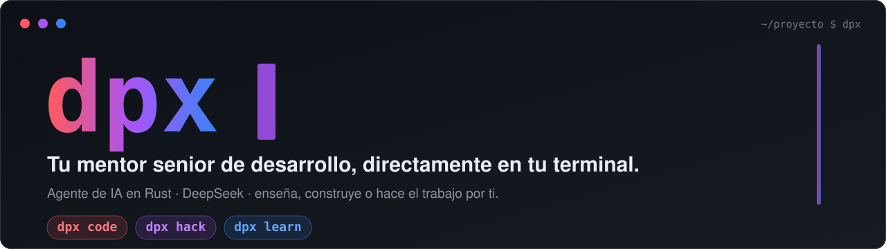

<div align="center">
  

  <br><br>

  [](https://www.rust-lang.org)
  [](#)
  [](#licencia)
  [](#desarrollo)
</div>

---

> **dpx** es un agente de ingeniería que vive en tu terminal. No es un autocompletador: según el **modo** que elijas, **hace el trabajo por ti**, **construye rápido con criterio**, o **te enseña a pensar como un senior**. Se hiper-enfoca por stack mediante *Focus Packs* y recuerda el contexto de tu proyecto entre sesiones.

```bash
dpx code     # agente autónomo: escribe, ejecuta, corrige
dpx hack     # construir rápido CON criterio (demo sólida, sin chapuza)
dpx learn    # tutor socrático: te enseña, tú escribes
dpx          # abre el modo por defecto del proyecto
```

---

## Tabla de contenidos

- [Instalación](#instalación)
- [Los tres modos](#los-tres-modos)
- [El cerebro (DeepSeek)](#el-cerebro-deepseek)
- [Focus Packs](#focus-packs)
- [Persistencia en .dpx/](#persistencia-en-dpx)
- [Modo autónomo (`/auto`)](#modo-autónomo-auto)
- [Comandos del REPL](#comandos-del-repl)
- [Herramientas (function calling)](#herramientas-function-calling)
- [Cómo funciona](#cómo-funciona)
- [Modo learn en detalle](#modo-learn-en-detalle)
- [Estructura del proyecto](#estructura-del-proyecto)
- [Configuración](#configuración)
- [Desarrollo](#desarrollo)
- [Licencia](#licencia)

---

## Instalación

**Vía npm** (Windows x64 — la forma rápida):

```bash
npm install -g @dpx-cli/dpx
dpx
```

> Descarga el binario nativo del último release; no necesitas tener Rust instalado.

**Desde el código** (cualquier plataforma con Rust):

```bash
git clone https://github.com/davidpp09/dpx-cli.git
cd dpx-cli
cargo install --path .
```

### Requisitos

- Rust edition 2024 (stable).
- API key de DeepSeek en `~/.dpx/.env` o en `.env` dentro del proyecto:

```env
DEEPSEEK_API_KEY=sk-...
```

> [!IMPORTANT]
> dpx usa **solo DeepSeek**. Sin la key arranca pero no puede responder.

### Primer arranque

Al abrir dpx en un proyecto **sin `.dpx/`** arranca un **wizard de configuración**: detecta el stack, eliges enfoque y nivel de autonomía, y guarda `.dpx/config.toml`. El modo lo fija el subcomando.

En **hack** con proyecto nuevo, dpx te pide tu idea y la pasa por el **comité** (4 roles) para sacar un plan antes de construir.

---

## Los tres modos

Un solo eje: tres modos excluyentes. Lo que cambia es el **rol**, no la calidad. Cada modo tiene su propia identidad visual (color de acento y banner con gradiente).

| Modo | Color | Qué hace | Cuándo |
|:---|:---|:---|:---|
| **code** | rojo | Agente autónomo: implementa, ejecuta, verifica y corrige. | Features, bugs, refactors. |
| **hack** | morado | Construye rápido pero **con criterio**: lo justo que resuelve el pedido, corriendo ya — sin sobre-escopar. | Prototipos, hackathones, demos. |
| **learn** | azul marino | Tutor socrático: te hace pensar y te enseña el porqué. **Tú escribes el código**, él te guía. | Aprender, entender, fijar conocimiento. |

```bash
dpx code --focus spring-boot   # agente enfocado en Spring Boot
dpx hack --auto all            # construir sin preguntar
dpx learn                      # el tutor socrático

# en vivo:
/modo hack                     # cambia de modo (y de color) al vuelo
```

Cada modo expone solo los comandos que le corresponden: `/comité` solo en hack, `/examen`/`/evaluar`/`/revisar` solo en learn, `/auto` solo en code/hack.

> `dpx` (sin subcomando) retoma el **último modo y focus** que usaste — el estado se guarda al cerrar.

---

## Casos de uso

**Aprender un stack desde cero** — `dpx learn --focus spring-boot`
> `enséñame inyección de dependencias`

El tutor explica el *porqué*, te deja escribir el código, te interroga (`/examen`) y trackea tu progreso (`/progreso`) con repaso espaciado y badges.

**Arreglar un bug** — `dpx code`
> `arregla el error de validación en UserService`

Un subagente flash mapea el código relevante, luego el cerebro pro edita, compila y corrige hasta dejarlo en verde (green-gate).

**Entender un codebase ajeno** — `dpx code`
> `¿dónde se valida el token JWT y cómo fluye?`

Delega la investigación al tier flash (barato) y te resume con archivos y líneas concretas.

**Prototipo rápido** — `dpx hack --focus node`
> `un endpoint que reciba un JSON y lo guarde en memoria`

Construye lo justo que corre ya, sin montar infraestructura que no pediste.

**Code review pedagógico** — en learn:
> `/revisar src/api/users.py`

Te dice qué está bien, qué mejorar y **por qué** — aprendes mientras revisas.

**Brainstorm antes de construir** — `dpx hack` (proyecto nuevo)
> `una CLI para gestionar tareas con prioridades`

4 roles (juez · product · tech lead · escéptico) evalúan la idea **en paralelo** y devuelven un plan antes de escribir una línea.

---

## El cerebro (DeepSeek)

dpx usa **solo DeepSeek** con dos tiers, repartidos por el Model Router:

| Tier | Modelo | Para qué |
|:---|:---|:---|
| **pro** | `deepseek-v4-pro` | Cerebro principal de cada turno. En learn usa `reasoning_effort: max`; en code/hack responde sin thinking (rápido). |
| **flash** | `deepseek-v4-flash` | ~12× más barato. Subagentes (investigación + mapeo de cambios), clasificación de tareas, comité y resúmenes. |

Los IDs de modelo se pueden sobreescribir con las variables `DEEPSEEK_MODEL_PRO` y `DEEPSEEK_MODEL_FLASH` (por si tu plan usa otros nombres). dpx muestra los IDs activos al arrancar.

Ventana de contexto: 128k tokens. dpx **compacta automáticamente** el historial al acercarse al límite, aligerando resultados de herramienta antiguos.

---

## Focus Packs

Cada pack inyecta conocimiento de dominio en el prompt: versiones exactas, buenas prácticas, errores comunes. Sin `--focus`, dpx detecta el stack por los archivos raíz (`pom.xml`, `Cargo.toml`, `package.json`…).

| Pack | Stack |
|:---|:---|
| `spring-boot` | Backend Java/Spring Boot |
| `react` | Frontend React (Vite, TanStack Query, RTL) |
| `node` | Backend Node.js (Fastify/Express, zod) |
| `python` | Backend Python (FastAPI, Pydantic v2, SQLAlchemy 2) |
| `rust` | Sistemas y CLIs en Rust (anyhow, tokio, clap) |
| `gradle` | Proyecto JVM con Gradle (en catálogo, sin pack dedicado aún — usa mentor general) |
| `dpx` | El propio dpx: arquitectura interna, para auto-editarse |

En modo **learn**, el pack también aporta el **temario** del stack (`/temario`).

---

## Persistencia en .dpx/

dpx guarda todo el estado del proyecto en `.dpx/` (añádelo al `.gitignore`):

| Archivo | Qué contiene |
|:---|:---|
| `config.toml` | Focus, modo y nivel de autonomía. Se **actualiza al cerrar** para que `dpx` (sin subcomando) retome el último que usaste. |
| `context.md` | Memoria viva: estado del proyecto, aprendizaje y próximos pasos. Se regenera al cerrar con `/salir`. |
| `sessions/*.jsonl` | Transcripción de cada sesión (un turn por línea JSON). Se escribe en caliente — un cierre brusco no pierde lo conversado. |
| `skills.md` | Progreso de aprendizaje del usuario por tema (learn). |
| `streak.md` | Racha de sesiones consecutivas de aprendizaje (learn). |
| `undo/` | Snapshot de archivos del último turno. `/undo` los restaura. Se limpia al empezar cada turno nuevo. |
| `plan.md` | Plan pendiente de la sesión anterior. Se muestra al arrancar y se inyecta en el contexto. |
| `committee.md` | Síntesis del último comité de hack. |
| `allowed_commands` | Comandos que el usuario marcó como "permitir siempre" en este proyecto (uno por línea). |

---

## Modo autónomo (`/auto`)

Disponible en **code** y **hack**. Se controla con `--auto <nivel>` (CLI) o `/auto <nivel>` en el REPL.

| Nivel | Sin preguntar |
|:---|:---|
| `off` (default) | Nada: cada acción se confirma. |
| `reads` | Lecturas/búsquedas (ya eran libres) + auto-extiende rondas. |
| `writes` | + escrituras y ediciones (diff visible igual). |
| `all` | + comandos **seguros**; tras escribir corre build + tests y se autocorrige (green-gate). |

Las puertas de seguridad se mantienen **siempre**, incluso en `all`:

| Acción | ¿Pregunta aunque esté en `all`? |
|:---|:---|
| `write_file` que trunca >40% del archivo (guard anti-truncado) | Sí |
| `write_file` sobre archivo existente ≥200 líneas (prefiere `edit_file`) | Sí |
| `run_command` peligroso (`rm -rf`, `git reset --hard`…) | Sí — confirmación reforzada |
| `run_command` prohibido (`format`, `shutdown`, `mkfs`…) | Bloqueado siempre |
| `delete_file`, `git_commit` | Sí |

> [!TIP]
> Con `/undo` reviertes todos los archivos del último turno a su estado original.

---

## Comandos del REPL

Los nombres son en **español**; los ingleses funcionan como alias. `/ayuda` muestra solo los comandos del modo activo.

| Comando | Modo | Acción |
|:---|:---|:---|
| `/ayuda` | todos | Lista los comandos del modo activo |
| `/estado` | todos | Config, cerebro, tokens, turno |
| `/modelos` | todos | Info del cerebro DeepSeek y su key |
| `/costo` | todos | Tokens consumidos + % de caché + costo estimado |
| `/presupuesto [N]` | todos | Tope de tokens (ej. `/presupuesto 100k`; `/presupuesto off` lo quita) |
| `/contexto` | todos | Memoria guardada del proyecto (`context.md`) |
| `/enfoque [id]` | todos | Cambia de stack (sin id: lista el catálogo) |
| `/modo [code\|hack\|learn]` | todos | Cambia de modo y de color de acento |
| `/cerebro` | todos | Info del modelo activo y su consumo |
| `/limpiar` | todos | Reinicia el historial de la conversación |
| `/compactar` | todos | Resume el historial para liberar contexto |
| `/undo` | todos | Restaura archivos del último turno desde `.dpx/undo/` |
| `/actualizar` | todos | Recompila e instala dpx desde el repo activo |
| `/salir` | todos | Termina la sesión y guarda `context.md` |
| `/auto [off\|reads\|writes\|all]` | code · hack | Nivel de autonomía |
| `/comité <idea>` | hack | 4 roles evalúan tu idea y dan un plan de acción |
| `/progreso` | learn | Tu progreso por tema, racha y badges desbloqueados |
| `/temario` | learn | Temario del stack y cuánto has cubierto |
| `/evaluar [tema]` | learn | El tutor te pregunta qué sabes antes de enseñarte |
| `/revisar [archivo]` | learn | Code review pedagógico (qué está bien, qué mejorar, por qué) |
| `/examen [tema]` | learn | Retrieval practice: una pregunta a la vez, sin dar respuestas de entrada |

Referencias de archivo con `@ruta/al/archivo` en cualquier mensaje (con autocompletado por Tab).

---

## Herramientas (function calling)

dpx expone **13 herramientas nativas** al modelo. Los bloques de texto `dpx:*` se mantienen como fallback para modelos que no cooperen con function calling.

| Herramienta | Función |
|:---|:---|
| `read_file` | Lee un archivo. Acepta `offset`/`limit` para leer rangos de archivos grandes. |
| `search_project` | Busca texto en el proyecto. Implementación **nativa en Rust** (sin shell): soporta alternación con `\|` y es inmune a comillas/pipes en Windows. |
| `write_file` | Crea o sobrescribe un archivo completo (con diff y confirmación). |
| `edit_file` | Edita un fragmento literal sin reescribir el archivo entero. |
| `delete_file` | Borra un archivo (con confirmación). |
| `run_command` | Ejecuta un comando de shell (clasificación Safe/Dangerous/Forbidden + sandbox). |
| `web_search` | Busca en DuckDuckGo (gratis, sin API key). |
| `web_fetch` | Lee el contenido de una URL (texto plano, hasta 8000 chars) — para leer documentación y artículos. |
| `spawn_agent` | Lanza subagente(s) flash aislados (solo lectura) para investigar sin llenar el contexto principal. Varios consecutivos corren **en paralelo**. |
| `git_status` | Estado del repo (solo lectura, sin confirmación). |
| `git_diff` | Diff del working tree, opcionalmente de un archivo. |
| `git_log` | Últimos N commits (default 10). |
| `git_commit` | Crea un commit con `git add -A` (muta el repo, pide confirmación). |

---

## Cómo funciona

### Ciclo de un turno

Cada mensaje dispara un **loop agéntico de hasta 4 rondas**:

1. **(code/hack)** Antes del turno, dpx clasifica la petición (clasificador flash + fallback por keywords): si es de **investigación**, un subagente flash la resuelve; si es un **cambio sobre código existente**, un subagente flash **mapea el terreno** (archivos y funciones implicados) para que el cerebro pro arranque enfocado. Crear de cero no delega.
2. El modelo responde con texto + tool calls.
3. dpx clasifica cada tool call: aplica escrituras/ediciones (con diff), atiende lecturas/búsquedas, ejecuta comandos con clasificación de riesgo.
4. Los resultados se realimentan; el modelo itera hasta cerrar el turno.

Si el modelo falla por error de red transitorio, **reintenta la ronda** sin perder el trabajo previo.

### Verificación automática (green-gate)

Al tocar código fuente o archivos de build, dpx detecta el comando de build y el de tests del proyecto:

- En modo confirmación (default): ofrece ejecutar ambos; puedes aceptar o saltar.
- En `/auto all`: los ejecuta sin preguntar, pasa los errores al modelo y se autocorrige. En Rust añade `cargo clippy -D warnings` antes de los tests.

### Estrategia de edición en 3 capas

`edit_file` aplica el bloque SEARCH/REPLACE en capas, de la más estricta a la más tolerante:

1. **Exacto**: `str::find` literal.
2. **CRLF-tolerante**: normaliza `\r\n` ↔ `\n` en ambos lados y mapea el offset de vuelta al original.
3. **Fuzzy por indentación**: compara líneas ignorando espacios de borde — si el LLM emitió el bloque con indentación incorrecta, igual lo encuentra.

La primera capa que acierta gana; nunca se degrada un match exacto.

### Seguridad de comandos

Tres niveles, clasificados antes de pedir confirmación:

- **Safe**: flujo normal (`[s/N/a=siempre]`). La allowlist del proyecto aplica.
- **Dangerous**: panel rojo + confirmación reforzada (hay que reescribir la primera palabra). La allowlist NO aplica.
- **Forbidden**: rechazado directo sin posibilidad de forzar (comandos que tocan el sistema operativo o disco).

### UI y experiencia visual

- **Streaming**: el texto aparece a medida que el modelo lo genera (rig-core streaming).
- **Typewriter**: la respuesta formateada se revela progresivamente en terminal.
- **Syntax highlighting**: bloques de código con resaltado real vía `syntect`.
- **Markdown renderizado**: `termimad` convierte la respuesta a terminal con formato.
- **Gradientes por modo**: el banner, el prompt y los bordes usan el color del modo activo (rojo · morado · azul marino), con degradados profundos.
- **Editor de entrada propio** (crossterm): multilínea (Shift/Ctrl+Enter), autocompletado *ghost* en gris para `@archivos` y `/comandos`, resaltado de comandos/refs, cursor (←→ Home End) y **pegados grandes colapsados en un chip** `[⎘ pegado · N líneas · M chars]`. Barra al pie con focus·modo y medidor de contexto.
- **Spinner animado**: mientras el modelo piensa.
- **Modo headless**: si stdin no es TTY (pipe, CI), entra en modo texto plano sin prompts interactivos.

### Subagentes y auto-delegación

`spawn_agent` lanza subagente(s) en el tier **flash** con contexto propio y aislado: solo lectura, sin historial del usuario. Devuelven solo su conclusión. Ideal para investigar código extenso sin llenar el contexto caro del modelo principal. Varios subagentes consecutivos corren **en paralelo** (igual que el comité de hack).

La **auto-delegación** clasifica cada petición (clasificador flash con fallback por keywords) en `research` / `modify` / `new`: una pregunta se investiga en flash, un cambio sobre código existente se **mapea** en flash antes de que pro edite, y crear de cero no delega — así el tier barato descarga la lectura del cerebro caro.

---

## Modo learn en detalle

El tutor socrático nunca resuelve: **enseña**. Tú escribes el código, él te guía.

**Al arrancar** una sesión learn, dpx muestra:
- Racha de sesiones consecutivas (si hay).
- Conceptos a repasar hoy (repaso espaciado: temas en `visto` o `practicando` que no se tocaron recientemente).
- Siguiente tema sugerido del temario.

**Durante la sesión**, el tutor:
- Usa el método socrático: preguntas que llevan al concepto, pistas graduales, retrieval practice al cerrar.
- Registra automáticamente tu progreso con `dpx:skill` en tres niveles: `visto → practicando → dominado`.
- No da la solución directa; da la siguiente pista mínima si estás atascado.

**Al cerrar** (`/salir`), muestra un resumen: qué aprendiste hoy, qué subió de nivel, racha actual y siguiente paso.

**Badges** computados on-the-fly desde el estado real de skills y racha:

| Badge | Condición |
|:---|:---|
| "primera chispa" | ≥1 skill registrada |
| "5 conceptos" | ≥5 skills |
| "10 conceptos" | ≥10 skills |
| "primer dominio" | ≥1 skill en "dominado" |
| "5 dominados" | ≥5 en "dominado" |
| "10 dominados" | ≥10 en "dominado" |
| "racha de 3" | racha ≥3 días |
| "semana entera" | racha ≥7 días |

---

## Estructura del proyecto

```text
src/
├── main.rs               # Entrada: carga .env, parsea CLI, despacha al modo
├── config.rs             # ProjectConfig (.dpx/config.toml): focus/brain/mode/auto
├── ui.rs                 # Toda la UI: tema por modo, markdown, spinner, typewriter,
│   └── prompts.rs        #   syntax highlighting, gradientes, confirmaciones
├── skill.rs              # Progreso del usuario: Skill, SkillLevel (visto/practicando/dominado)
├── streak.rs             # Racha de sesiones: update(), from/to_markdown(), message()
├── token.rs              # Ledger de tokens: conteo real, presupuesto, session_summary()
├── agent/
│   ├── mod.rs            # Brain, Mentor, ChatReply, has_key()
│   ├── router.rs         # ModelRouter: pro/flash, streaming, compactación
│   ├── tools.rs          # DpxCall (12 tools), definitions(), parse_call()
│   └── search.rs         # web_search() sobre DuckDuckGo
├── focus/
│   ├── mod.rs            # Mode, Focus, catalog(), system_prompt(), domain_skills()
│   ├── committee.rs      # Comité hack: 4 roles, síntesis en flash
│   ├── curriculum.rs     # Temario por stack, next_topic(), render()
│   ├── spring_boot.rs    # Pack Spring Boot
│   ├── react.rs          # Pack React
│   ├── node.rs           # Pack Node.js
│   ├── python.rs         # Pack Python/FastAPI
│   ├── rust.rs           # Pack Rust
│   └── dpx.rs            # Pack dpx (auto-edición)
├── cli/
│   ├── mod.rs            # AutoMode, subcomandos clap
│   ├── init.rs           # Onboarding y dpx init
│   ├── editor.rs         # InputEditor: TUI propio (crossterm) — multilínea Shift+Enter,
│   │                     #   autocompletado ghost @archivos//comandos, cursor, pegado en chips
│   └── chat/
│       ├── mod.rs        # Loop principal del REPL, green-gate, undo snapshot
│       ├── actions.rs    # Ejecución de tool calls: diff, confirmaciones, sandbox
│       ├── commands.rs   # Dispatcher /..., build_evaluar/revisar/quiz_prompt()
│       ├── helpers.rs    # canonical_cmd(), command_in_mode(), mode_label()
│       ├── committee.rs  # run_comite_command()
│       ├── recall.rs     # classify_delegation(), maybe_auto_delegate(), run_subagent()
│       └── tests.rs      # Tests de integración del REPL (53 tests)
├── session/
│   └── mod.rs            # ProjectStore (.dpx/): context, skills, streak, undo, plan, allowlist
└── fs/
    ├── mod.rs            # Orquestación: parse bloques, write/edit/delete con diff, repo-map
    ├── detect.rs         # detect_stack(), detect_build(), detect_test()
    ├── edit.rs           # Edición quirúrgica en 3 capas: exacta, CRLF, fuzzy-indent
    ├── exec.rs           # run_command_streaming(): sandbox, timeout, output en tiempo real
    ├── grep.rs           # search_project(): búsqueda nativa en Rust (sin shell) + orphan-sweep
    ├── safety.rs         # CommandRisk: Safe / Dangerous / Forbidden
    └── tree.rs           # repo-map: índice de símbolos por archivo (heurística por lenguaje)
```

---

## Configuración

`.dpx/config.toml` (creado por el onboarding o `dpx init`):

```toml
focus = "spring-boot"
brain = "deepseek"
mode  = "code"      # code | hack | learn
auto  = "off"       # off | reads | writes | all
```

Los flags de CLI (`--focus`, `--auto`) pisan estos defaults; los comandos del REPL los cambian en caliente.

---

## Desarrollo

```bash
cargo check                                    # compilación rápida
cargo test                                     # 150 tests verdes
cargo clippy --all-targets -- -D warnings      # linter estricto (cero warnings)
```

Dentro del propio repo de dpx, **`/actualizar`** recompila e instala el binario sin cerrar la sesión. En Windows renombra el `.exe` en uso antes de instalar para evitar el `os error 5` (archivo bloqueado).

> [!NOTE]
> En Windows, `cargo install` falla con `os error 5` si hay una sesión de dpx abierta. Cierra la sesión primero, o usa `/actualizar` desde dentro.

---

## Licencia

Distribuido bajo licencia **MIT**. Eres libre de usar, copiar, modificar y distribuir este software; solo conserva el aviso de copyright. Ver [`LICENSE`](LICENSE) para el texto completo.
